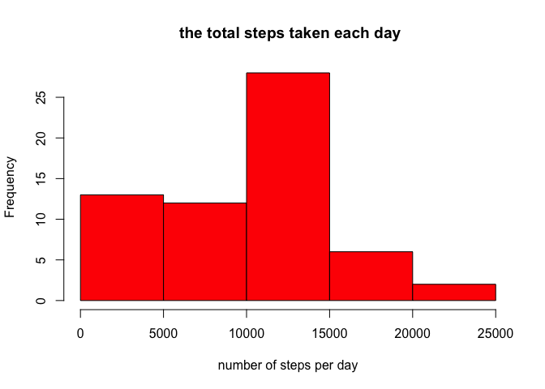
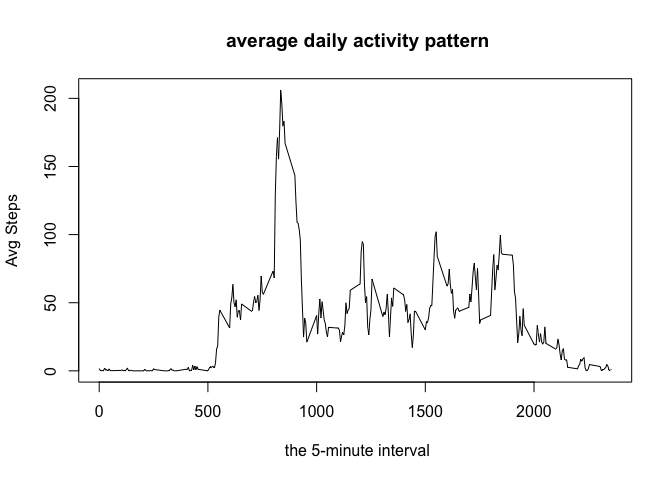
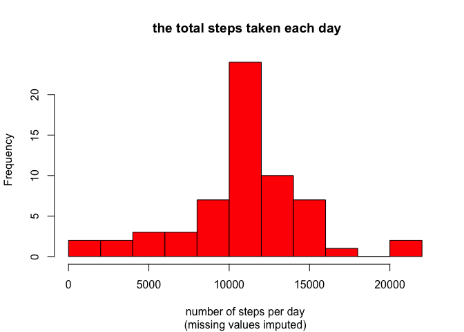

# Reproducible Research: Peer Assessment 1


## Loading and preprocessing the data
 We unzip the file into CSV and read it into data 

```r
unzip("activity.zip","activity.csv")
data<-read.csv("activity.csv",header=TRUE,sep=",", na.strings="NA")
```

## What is mean total number of steps taken per day?
there is the difference between barplot and histogram. With bar charts, each column represents a group defined by a categorical variable; and with histograms, each column represents a group defined by a quantitative variable. So we use the histogram to show the answer.
I calculate the total number of steps taken per day by using tapply.


```r
steps_sum<-with(data,tapply(steps,date,sum,na.rm=T))
hist(steps_sum, col="red", xlab = "number of steps per day", main = " the total steps taken each day")
```

 

The following numbers is mean 


```r
steps_mean<-mean(steps_sum,na.rm=TRUE)
steps_mean
```

```
## [1] 9354.23
```

The following number is median


```r
steps_median<-median(steps_sum,na.rm=TRUE)
steps_median
```

```
## [1] 10395
```

## What is the average daily activity pattern?
I using tapply to generate an average daily activity pattern that is plotted as a time series.

```r
steps_avg<-with(data,tapply(steps,interval,mean,na.rm=TRUE))
plot(names(steps_avg), steps_avg, type="l", main = " average daily activity pattern", xlab=" the 5-minute interval", ylab="Avg Steps")
```

 

In the dataset, the maximum number of steps occurs is at 835

```r
print(names(which.max(steps_avg)))
```

```
## [1] "835"
```


## Imputing missing values
There are 2304 missing values in the data set

```r
sum(is.na(data))
```

```
## [1] 2304
```
I use the mean for that 5-minute interval as my strategy.

```r
impute <- transform(data, steps=ifelse(is.na(steps), steps_avg, steps))
```
Now, I can use the impute to calculate the mean and median total number of steps taken per day by using tapply again.

```r
total_imsteps<-with(impute,tapply(steps,date,sum,na.rm=TRUE))
imsteps_mean<-mean(total_imsteps,na.rm=TRUE)
imsteps_median<-median(total_imsteps,na.rm=TRUE)
imsteps_mean
```

```
## [1] 10766.19
```

```r
imsteps_median
```

```
## [1] 10766.19
```
Make a histogram of the total number of steps taken each day

```r
hist(total_imsteps,breaks=10, col="red", xlab = "number of steps per day", sub="(missing values imputed)", main = " the total steps taken each day")
```

 
  
  It is the imputation so the total sum of steps in these two month increases increases as below  

```r
sum(data$steps, na.rm=TRUE)
```

```
## [1] 570608
```

```r
sum(impute$steps)
```

```
## [1] 656737.5
```
## Are there differences in activity patterns between weekdays and weekends?
First, I create a new factor variable in the dataset with two levels – “weekday” and “weekend”

```r
library(plyr)
library(lattice)
weekdays <- weekdays(as.Date(impute$date))
data_with_weekdays <- transform(impute, day=weekdays)
data_with_weekdays$wk <- ifelse(data_with_weekdays$day %in% c("周六", "周日"),"weekend", "weekday")
```
Second, I make a panel plot by using larrice to create a time series plot of the 5-minute interval (x-axis) and the average number of steps taken, averaged across all weekday days or weekend days (y-axis).

```r
average_by_interval_wk <- ddply(data_with_weekdays, .(interval, wk), summarise, steps=mean(steps))
xyplot(steps ~ interval | wk, data = average_by_interval_wk, layout = c(1, 2), type="l")
```

 
